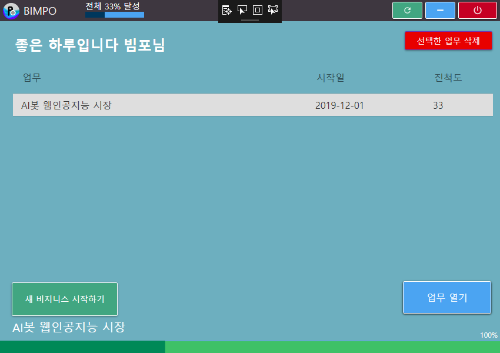
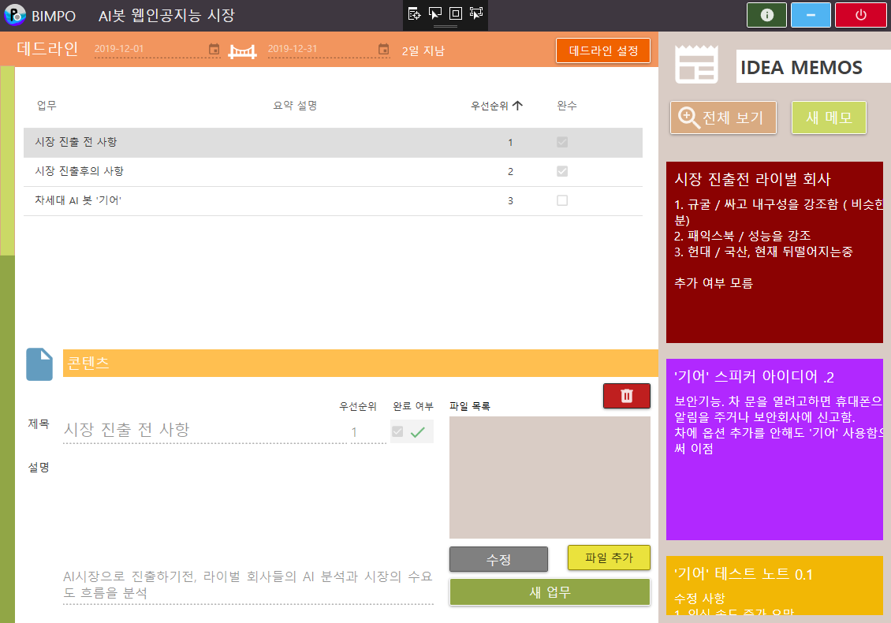
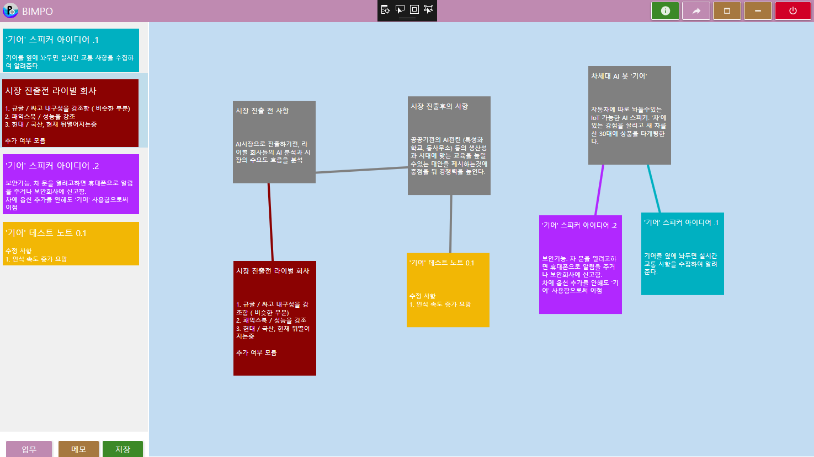

#당신의 프로젝트에 대한 최고의 선택 BIMPO
BIMPO는 사업의 진행도를 총괄적으로 볼수있고 다양한 편의 기능들로 사업을 확장하는데에
필요한 프로그램입니다.

사업이 안정적으로 확장되고 성장하는것을 원하신다면 BIMPO가 정답이 될 수 있습니다.
BIMPO는 다양한 편의 기능들이 있습니다 이 기능들에 대해 설명하겠습니다.

스타트업 윈도우
==============

이곳에서는 새 비지니스를 생성하거나 삭제할 수 있습니다.
사업 목록중의 사업을 더블클릭(double click)하여 선택한후, '열기' 버튼을 눌러 열 수 있습니다.
여러 비지니스들을 열 수 있는데 사업을 분리해 작성하며 총괄적으로 볼 수 있는 장점이 있습니다.

비지니스 윈도우
==============

여기서는 사업에 대한 편의 기능들을 제공합니다. 모든 기능들은 활용시에 매우 강력한 기능으로 바뀝니다.

데드라인 기능
------------
데드라인 설정을 통해 한층 더 구체적이고 선명한 비지니스의 미래를 정할 수 있습니다.
날짜는 시작일과 종료일로 구성되어있으며 자동적으로 종료일에 대한 현재 날짜를 계산해드립니다.
데드라인 설정으로 인한 업무 생산성 증가는 필연적입니다.

업무 추가 기능
-------------
업무 추가 기능으로 업무에 대한 제목과 간단한 설명을 추가해 식별성을 더 합니다.
업무는 더블클릭(double click)하여서 자세히 콘텐츠 창에서 볼 수 있으며, 업무 수행 여부를 따져
비지니스의 총괄 진행도를 계산합니다. 업무 수행 여부도 마찬가지로 수정 가능 합니다 그리고
업무의 중요 우선순위를 책정해 우선순위대로 정렬하여 관리가 가능합니다. 간단한 것이지만
관리고 처리해 나가는데 있어서 매우 강력합니다.

메모 기능
--------
쉽고 빠르게 메모를 추가할 수 있습니다. 메모들은 간단한 요소들로 이루어 져 있습니다.
그래서 조금 전에 떠올랐던 생각들을 타이핑 하는 도중에 잊어버리지 않도록 최대한
기억을 보존할수있는 방향으로 설계되었습니다.

다이어그램 쇼 윈도우
==================

다이어그램쇼 윈도우에서는 사용자가 추가했던 모든 업무와 메모들을 다이어그램에 끌어와
관련된것들에 대해 연결선을 이을수 있는 기능을 제공합니다.

선 연결 기능
-----------
메모와 메모, 업무와 메모 등 다양한 조합으로 선을 연결 할 수 있습니다.
좌측 아래의 메모와 업무 버튼을 눌러 다이어그램 요소를 전환할 수 있으며, 더블클릭(double click)을 통해
다이어그램에 추가 할 수 있습니다. 추가된 요소들은 모두 선으로 연결될수 있습니다.
선으로 연결시에는 다른 요소들을 움직이면 선도 그에 따라 모양을 유지하면서 커집니다.

저장 기능
--------
원할때 저장 버튼을 누르거나, 종료를 하면 자동으로 저장이 됩니다. 모든 정보들이 바이너리에 저장이 되며
픽셀단위 위치까지 정확하게 저장이 됩니다.

공유 기능
--------
다이어그램 상황을 찍어서 파일로 저장해드립니다.

사용법
-----
1. 선 생성
마우스를 요소 위에 가져온 다음, + 버튼 위에서 우클릭을 통해생성합니다. 그리곤 마우스에서 손을 떼도 되겠습니다.
마우스를 움직여 다른 요소로 가서 우클릭을 다시 하면 완료입니다. 만약 자기 자신이거나 아무것도 없으면 삭제됩니다.
2. 선 삭제/요소 삭제
선 위에서 우클릭을 하시면 삭제가 됩니다. 요소삭제는 연결된 선이 없을 경우에만 가능합니다.
요소 삭제도 마찬가지로 우클릭으로 삭제할 수 있습니다.
2. 요소 이동
요소 위에서 마우스 좌클릭을 한 상태로 움직이면 가능합니다.
